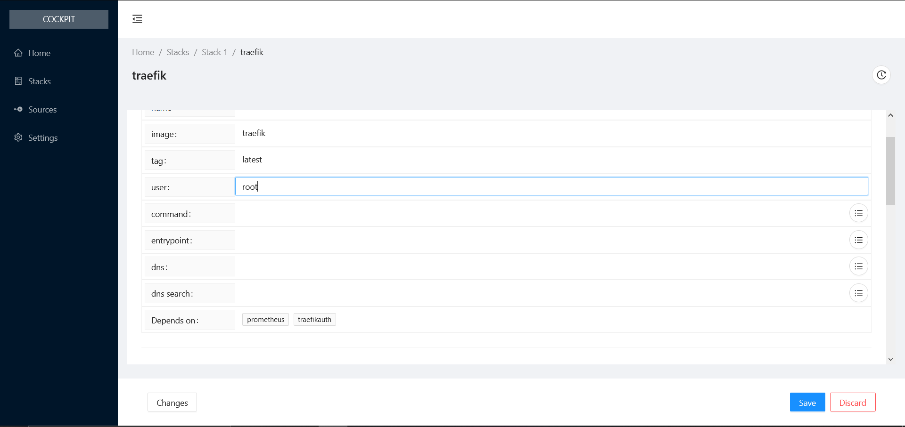
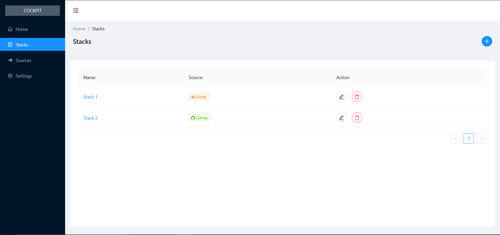
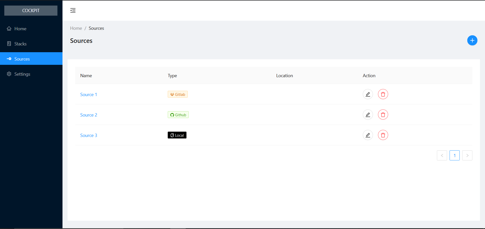

# cockpit project

Cockpit is a web docker-compose file editor which allows you to manage a docker environment using the gitops best practices. 

This project is a work in progress.

Features: 

* Read stacks from multiple git sources (Gitlab, Github, Local) [IN PROGRESS]
* Edit stack file (docker-compose.yml) with a web editor [DONE]
* Visualize changes made on the file [IN PROGRESS]
* Save file by commiting it or create a pull request [TO DO]
* Automatically Create CI-CD pipelines (gitlab-ci.yml ...) [TO DO]
* Navigate in git history and restore passed versions of a stack [TO DO]
* Connect to Docker engine (in read only) and Display stack status & logs [TO DO]

# Stack Editor



# Stack List



# Git Sources List

# Start Project

create the database
```
docker-compose up
```
start the backend
```
mvn quarkus:dev
```
start the frontend
```
yarn dev
```